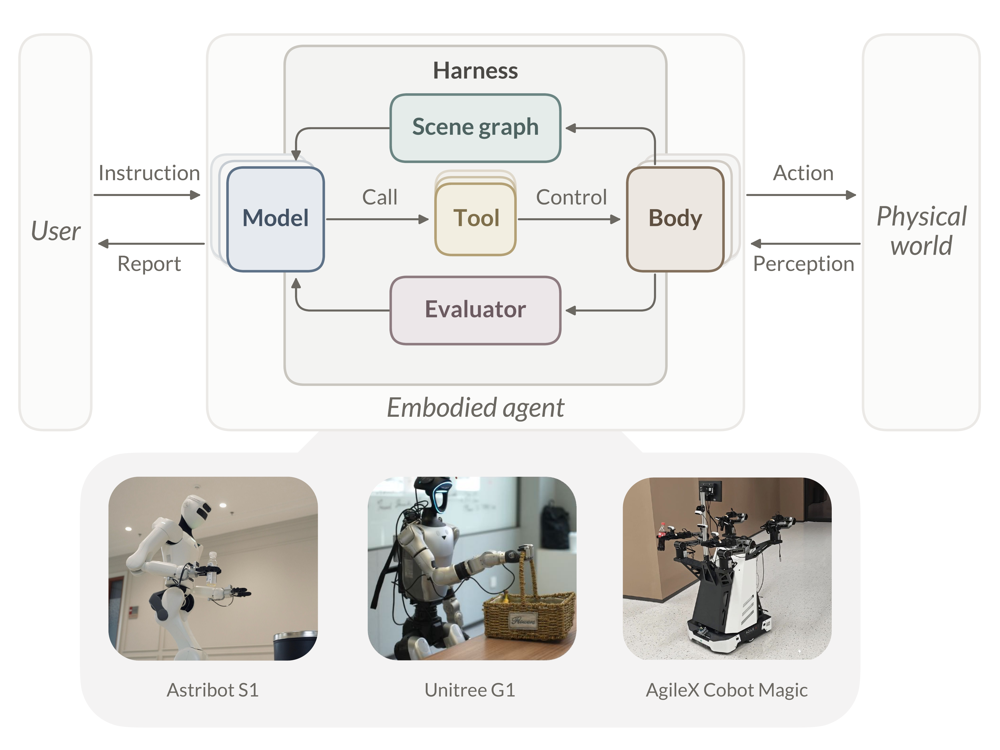

# 迈向具身智能体的 Harness（Towards the Harness of Embodied Agents）

> 第 1 章 引言 · 中文编译导读
> 原文：<https://eit-hai.github.io/thea/intro.html> ｜ 论文：[arXiv:2608.11246](https://arxiv.org/abs/2608.11246) ｜ 代码：[GitHub](https://github.com/EIT-HAI/Thea) ｜ 视频：[YouTube](https://youtu.be/Sm9jFmfnOF0) / [Bilibili](https://www.bilibili.com/video/BV1q9uc6tEqJ/)
> 作者单位：宁波东方理工大学 HAI Lab
>
> 说明：本文为按原文结构整理的中文编译，保留要点与论证脉络，措辞经过重新组织；精确表述请以原文为准。

---

## 1 引言

**图 1.** **Thea** 总览。Harness 把一个“模型”和一个“身体”（二者都可替换）连接成一个具身智能体：模型通过调用工具来控制身体，再从**场景图**读回世界状态、从**评估器**读回执行结果，从而闭合回路。该 harness 可在不同本体间迁移，作者在三种不同的机器人平台上进行了验证。

### 从编程智能体说起

以 Claude Code、Codex 为代表的**编程智能体**[1,2,3] 改变了软件工程：它们不追求一次写对，而是“写 → 测试 → 读报错 → 修复 → 再测试”，在闭环中逐步收敛到正确结果。

作者指出，关键不在于更强的模型，而在于更好的 **harness**[4,5]——即围绕模型的基础设施：让模型扎根于环境、通过工具中介其动作、并借助评估与恢复机制把“意图”和“结果”连成闭环。复杂行为来自一个简单的智能体循环（agentic loop）[6] 与工具之间的交互；接入新工具，同一套架构就能写文档、调外部服务、与用户完成开放式任务，而无需改动模型或循环本身。Harness 已经成为一种范式[7]。

### 物理世界缺的是“编排”

但上述一切都发生在数字环境里。在物理世界，基础模块其实已经具备：具身基础模型已能较好地完成导航、操作日常物体等任务[8,9,10]。然而，一堆强大的原子能力并不等于一个有用的机器人。真正悬而未决的是**编排（orchestration）**：如何在与人共处的动态世界中，把这些能力组织成长时程行为。

这恰恰是编程智能体在数字世界中已经证明可解的问题——它们的答案不是等待一个全能模型，而是构建精心设计的 harness 来放大模型的能力。那么，这一范式在物理世界是否同样成立？

### 编程智能体提供的蓝图

智能体本质上是“感知—行动”的闭环。编程智能体的架构天然可以借鉴：每一轮，语言模型选择一个工具（读文件、跑测试、改代码），观察结果，再决定下一步。同理，机器人的每项能力（导航、操作等）也可以封装成可调用的工具，由语言模型通过同一个智能体循环来编排。

这种设计将**编排与执行解耦**：循环只通过工具接口访问策略和平台，不关心其内部实现。复杂的长时程任务无需一次性整体求解，而是被逐步推进，新行为由工具的灵活组合涌现出来。

### 但事情没那么简单：两道鸿沟

乍看之下，把蓝图搬到物理世界只需重新定义工具。实际并非如此。闭合回路需要两种能力：**读取世界状态**，以及**判断动作结果**。软件环境免费提供这两者，物理世界一样都不给。

> **鸿沟 1：世界的可读性**
>
> - **软件环境**是人为设计的产物，本就为机器读取和执行而构建。源代码是文本，模型可以直接读、grep、diff、推理。环境本身是结构化、符号化、持久的，智能体任何时刻都能完整、精确地获取全部状态。
> - **物理世界**不是设计出来的，它只是存在。具身智能体靠传感器感知，输入是 30 fps 的 RGB-D 视频流——连续、高维、无结构。它每次只能看到局部、瞬时的一小片，必须逐帧拼出全貌并记在记忆里，世界本身不留存任何记录。
> - 一句话：编程智能体的“代码库”是现成的，物理智能体的“代码库”必须自己构建。

> **鸿沟 2：结果的可验证性**
>
> - **软件环境**有一个容易被视为理所当然的优雅性质：每个动作都有天然的**终止信号**和明确的**成功/失败判定**——进程会退出、命令返回退出码、错误输出到 `stderr`。跑一次测试就知道 `PASS` 还是 `FAIL`，失败时还能看栈回溯定位原因。这套闭环由操作系统和编程语言免费提供。
> - **物理世界**什么都没有。视觉-语言-动作（VLA）策略输出的是连续动作流，没有内置的“完成”信号，也没有退出码，世界不会告诉你“抓取成功”。夹爪合上了——到底抓住了杯子，还是杯子滑掉了？夹住的是空气，还是杯沿？
> - 一句话：编程智能体的“测试套件”是现成的，物理智能体的“测试套件”必须自己构建。

### 为什么恰好是这两道鸿沟

编程智能体眼中“免费”的东西，其实是几十年软件工程的积累：形式文法、类型系统、持久化文件系统让软件状态**可读**；退出码、栈回溯、测试框架让动作结果**可验证**。这些并非为编程智能体而建，它们只是“到场时一切已就绪”。物理环境没有这份遗产，缺失的基础设施必须补建。

这两道鸿沟也不是随意凑成的一对。智能体循环只能通过一个双向接口触达环境：**动作向外流出，信息向内流回**。向外的一半正是机器人学几十年来一直在建设的，所以策略很容易被包装成工具；向内的一半恰好承载两类信号——世界状态，以及对上一个动作的评判，这与经典的“智能体—环境”接口[11] 返回的内容完全一致。因此鸿沟正好有两个，各对应一个缺失的信号。

### Thea 的方案

作者提出 **Thea**（名字取自希腊语 *thea*，意为“视觉；景象”），一个面向具身智能体的 harness。Thea 继承了编程智能体的架构——同样的智能体循环、以工具形式暴露的能力、上下文、技能和记忆——并在此基础上补齐物理世界缺失的部件：

- **场景图即上下文（Scene Graph as Context）**：恢复**可读性**。维护一个持久、结构化的场景模型，语言模型可以像读源码一样读取和推理它。
- **评估即退出码（Evaluation as Exit Codes）**：恢复**可验证性**。检测动作何时应终止、判断是否成功，失败时诊断原因，把物理世界原本敞开的回路闭合起来。

作者通过 Thea 表明：经过合理适配，编程智能体背后的 harness 同样很适合具身智能体。它能把多样的基础模型、策略和本体整合为一个可工作的整体，并呈现以下特性（见图 1）：

- **可扩展性**：能力围绕工具组织。加一个工具就扩展了智能体，新策略只是多一个工具；复杂行为来自工具的自由组合，而非手工编写。
- **可移植性**：模型与身体即插即用。更换模型或本体都无需专门重新设计，因为架构中没有任何部分绑定于特定模型或本体。
- **连接用户与世界的桥梁**：对用户而言，智能体是自然的交互界面，指令、提问、解释都通过对话进行；对世界而言，它自主地一轮轮运行经典的感知—行动循环。智能体居中桥接，把用户意图转化为物理世界中流畅的执行。

---

## 参考文献

1. Anthropic (2026), [*Claude Code by Anthropic: An Agentic Coding System*](https://www.anthropic.com/product/claude-code).
2. OpenAI (2026), [*Codex: AI Coding Partner from OpenAI*](https://openai.com/codex/).
3. Jimenez et al. (2024), [*SWE-bench: Can Language Models Resolve Real-world Github Issues?*](https://arxiv.org/abs/2310.06770)
4. Hashimoto (2026), [*My AI Adoption Journey*](https://mitchellh.com/writing/my-ai-adoption-journey).
5. Lopopolo (2026), [*Harness Engineering: Leveraging Codex in an Agent-First World*](https://openai.com/index/harness-engineering/).
6. Anthropic (2026), [*How the Agent Loop Works*](https://code.claude.com/docs/en/agent-sdk/agent-loop).
7. Weng (2026), [*Harness Engineering for Self-Improvement*](https://lilianweng.github.io/posts/2026-07-04-harness/).
8. Brohan et al. (2023), [*RT-1: Robotics Transformer for Real-World Control at Scale*](https://arxiv.org/abs/2212.06817).
9. Octo Model Team et al. (2024), [*Octo: An Open-Source Generalist Robot Policy*](https://arxiv.org/abs/2405.12213).
10. Black et al. (2025), [*π0.5: A Vision-Language-Action Model with Open-World Generalization*](https://arxiv.org/abs/2504.16054).
11. Sutton and Barto (2018), [*Reinforcement Learning: An Introduction*](http://incompleteideas.net/book/the-book-2nd.html).

---

下一章：[2 Harness 为何有效](02-harness.md) ｜ [目录](README.md)
