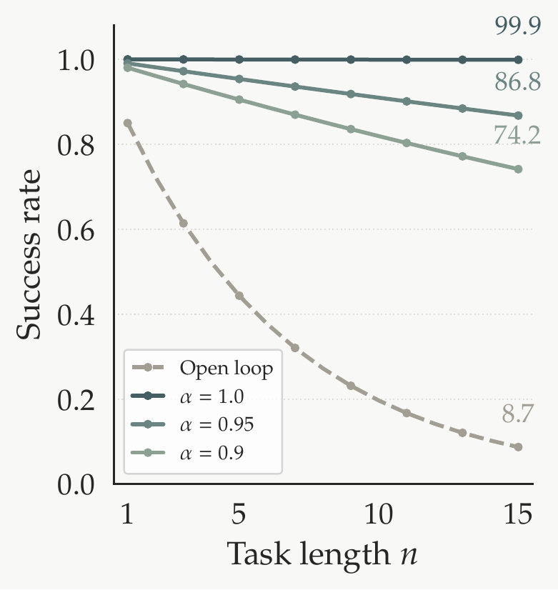

# 2 Harness 为何有效（Why the Harness Works）

> 原文：<https://eit-hai.github.io/thea/harness.html> ｜ 中文编译导读，精确表述以原文为准
> 上一章：[1 引言](01-intro.md) ｜ 下一章：[3 系统架构](03-system.md)

---

原则上，编程智能体的范式可以迁移到物理世界：每项机器人能力都变成可调用的工具，由语言模型通过智能体循环来编排[12]。作者的目标就是构建让这种迁移真正可行的 harness。

但这里有一个问题：harness 只负责**编排**，并不改变组件本身。同一个策略经 harness 调用，单次尝试的结果分布不变。**既然没有任何单个组件变得更容易成功，整个系统凭什么更可靠？** 本章把这个问题形式化，并分析哪些因素决定收益、对设计意味着什么。

## 开环执行

考虑一个 n 步任务，第 i 步成功概率为 pᵢ。开环执行时，只有每一步都成功，任务才成功：

$$P_{\text{open}} = \prod_{i=1}^{n} p_i \tag{1}$$

每个小于 1 的因子都在累积损失，乘积随 n 呈几何衰减。对家庭机器人来说，长时程任务往往要跨房间导航、与多个物体交互，n 很容易变大。

## 加上“检测—重试”

现在假设 harness 给每一步套上检测—重试循环，每步最多尝试 k 次。每次尝试后，评估器以准确率 α 判定成功或失败（以概率 α 判对，1−α 判错）。

每次尝试有四种结果：

| 真实结果 | 评估器判定 | 概率 | 后果 |
|---|---|---|---|
| 成功 | 判为成功 | pᵢ·α | 通过 ✅ |
| 成功 | 判为失败 | pᵢ·(1−α) | 误触发重试 |
| 失败 | 判为失败 | (1−pᵢ)·α | 正确重试 |
| 失败 | 判为成功 | (1−pᵢ)·(1−α) | 漏检，错误放行 ❌ |

只要评估器报告失败（无论对错）就会重试，其概率为：

$$r_i = p_i(1-\alpha) + (1-p_i)\alpha$$

第 j 次尝试成功的条件是：前 j−1 次都触发了重试（概率 rᵢ^{j−1}），且第 j 次是真实成功并被正确放行（概率 pᵢα）。这些事件互斥，因此 k 次内真正成功的概率为：

$$p_i^*(\alpha,k) = \sum_{j=1}^{k} r_i^{\,j-1}\cdot p_i\alpha = p_i\alpha\cdot\frac{1-r_i^{\,k}}{1-r_i} \tag{2}$$

**几个特殊情形：**

- **α = 1（完美评估器）**：rᵢ = 1−pᵢ，pᵢ* = 1−(1−pᵢ)^k，失败率随 k 指数压缩。
- **α = 1/2（随机猜）**：pᵢ* = pᵢ(1−2^{−k}) ≤ pᵢ，永远不会超过单次成功率。
- **k 足够大**：pᵢ* 趋于上限 $\dfrac{p_i}{(2p_i-1)+(1-p_i)/\alpha}$，随 α 单调递增，α = 1 时达到 1。

代入所有步骤的乘积，harness 下的任务可靠性为：

$$P_{\text{harness}} = \prod_{i=1}^{n} p_i^*(\alpha,k) = \prod_{i=1}^{n} p_i\alpha\cdot\frac{1-r_i^{\,k}}{1-r_i} \tag{3}$$

也就是说，开环乘积中的每个 pᵢ 都乘上了一个逐步放大系数 $\alpha\cdot\frac{1-r_i^k}{1-r_i}$。即使 α 只是中等水平，收益也相当可观（见图 2）。

**图 2.** 开环与不同评估准确率 α 下的 harness，任务成功率随任务长度 n 的变化。单步成功率 p = 0.85，每步最多重试 k = 5 次。

## 对设计的启示

公式明确了 harness 应当提供什么：**可靠的评估（α → 1）**。每多一次重试，提升按几何级数递减，而上限直接受 α 约束。在软件里，α ≈ 1 是理所当然的；在物理世界里，它必须主动构建、尽力提高——这是首要的设计挑战。

该公式基于两个简化假设，而对设计良好的 harness 来说，二者都是**保守**的：

- **步内重试**：式 (2) 假设每次重试是独立同分布的（同一个 pᵢ）。若不加调整地重复执行同一策略，可能反复失败，比独立抽样还差。但好的 harness 会诊断失败原因并调整下一次尝试，例如调整机器人位置或换一个更合适的抓取策略，使重试越来越可能成功。
- **步间计划固定**：公式假设开环和 harness 执行的是同一个 n 步序列。实际中机器人会遇到固定计划无法预料的情况——规划时开着的门现在关上了、物体被挪走了。harness 在每一步前读取世界状态并自适应重规划，相当于直接提高了 pᵢ 本身。

对设计良好的 harness，这两个效应都有利，因此该公式只是其真实优势的**下界**。后续章节的 harness 设计正是基于这些考量。

---

## 参考文献

12. Berman et al. (2026), *Claude Plays Robotics*.
