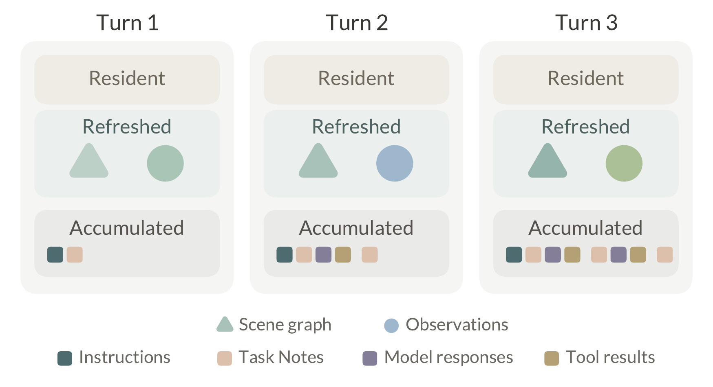
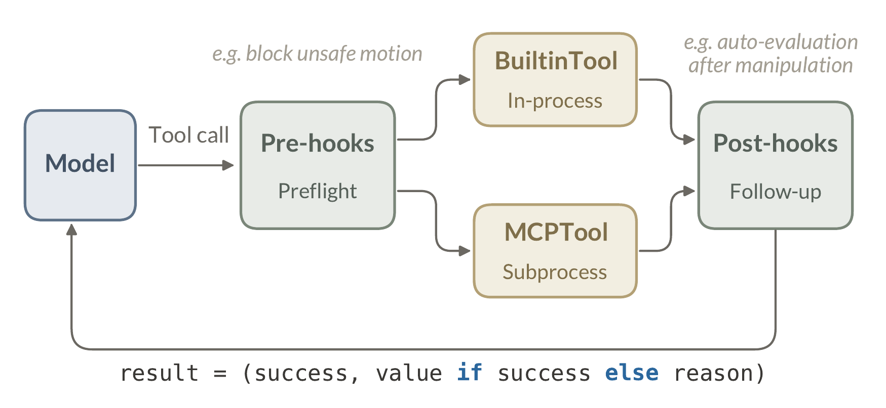
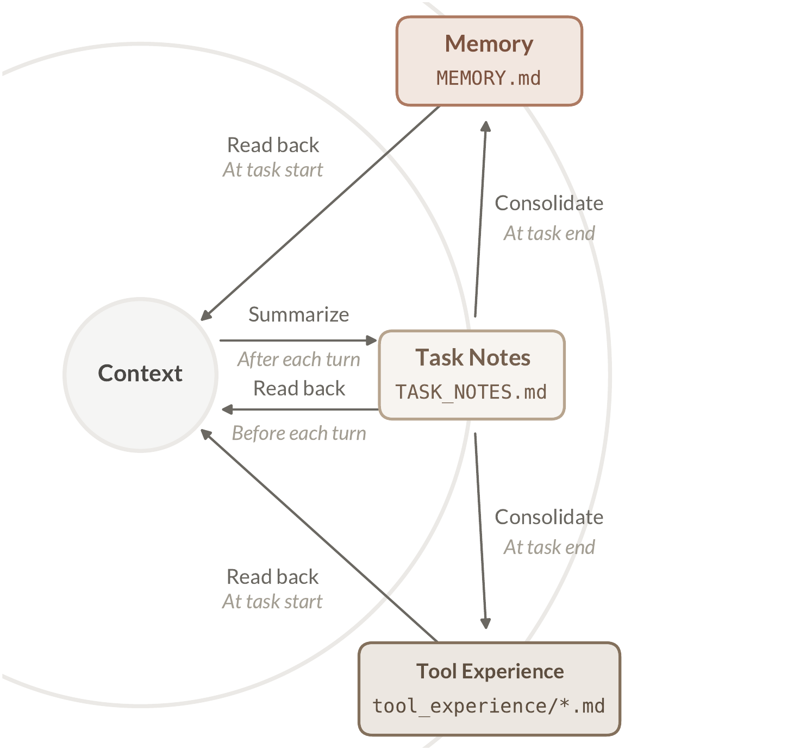

# 3 系统架构（System Architecture）

> 原文：<https://eit-hai.github.io/thea/system.html> ｜ 中文编译导读，精确表述以原文为准
> 上一章：[2 Harness 为何有效](02-harness.md) ｜ 下一章：[4 弥合鸿沟](04-gaps.md)

---

本章围绕一个问题展开：**编程智能体的每个组件，在物理世界中应该是什么形态？** 答案分为以下几部分：

- **智能体循环**（§3.1）驱动整个智能体。每一轮，模型（一个视觉-语言模型）读取世界状态并发出工具调用，由 harness 执行；“策略（policy）”一词专指工具所调用的底层控制器。
- **上下文工程**（§3.2）决定模型每轮实际读到什么。
- **工具协议**（§3.3）规定每项能力如何封装，使循环能统一执行。
- **技能系统**（§3.4）在需要时把领域知识注入上下文。
- **记忆系统**（§3.5）让智能体在从单个任务到整个部署生命周期的各个尺度上积累经验。
- **安全**（§3.6）界定智能体到底被允许做什么。

每个组件都继承自编程智能体的架构，又都因物理世界的需求而有所改造。物理世界需要、却无处继承的组件，放在第 4 章讨论。

---

## 3.1 智能体循环（Agentic Loop）

> **全文使用的时间单位**
> - **轮（turn）**：循环的一个周期 = 一次模型调用 + 它请求的工具执行。
> - **任务（task）**：一条用户指令从开始到完成；跨越所需的若干轮，模型不再返回工具调用时结束。
> - **会话（session）**：与用户的一次连续交互；其中可包含多个先后任务，累积的消息跨任务保留。

Listing 1 展示了智能体循环：每一轮，harness 收集上下文，模型读取并选择下一步动作，harness 执行模型指定的工具调用并追加结果；没有工具调用的回复即结束任务。这与驱动编程智能体的循环完全相同——同样累积消息、同样的终止约定，控制流就这么几行。

```python
def agent_loop(instruction, session) -> str:
    """感知、决策、行动，循环直至完成。"""
    messages = session.messages
    messages.append(instruction)
    while True:
        # 感知：收集模型要读的内容
        context = build_context(session)
        # 决策：模型选择下一步动作
        response = llm(context)
        messages.append(response)
        if not response.tool_calls:  # 完成
            update_memory(session)
            return response.text
        # 行动：每轮只执行一个工具调用
        call = response.tool_calls[0]
        messages.append(execute(call))
```

**Listing 1.** 智能体循环。（`build_context` 见 §3.2；`update_memory` 见 §3.5）

模型读到的一切都由 `build_context` 精心组织，从持久指令到每轮新采集的物理证据；它依赖的世界状态见 §4.1。

**和编程智能体一样，所有能力都以工具形式暴露。** 导航、操作、评估、用户交互都是同一张扁平工具注册表中的条目，循环对其中任何一个都没有特殊逻辑。模型**每轮只发出一个工具调用**，因为物理动作及其后果难以预测。这种反应式原则（执行一个调用 → 观察结果 → 再决定下一步）让智能体能适应它无法完全预料的世界。

在这种设计下，**评估也是一个工具，但何时调用不由模型决定**。编程智能体中评估是隐形的：shell 命令会返回退出码和栈回溯，模型像读其他工具输出一样读它。物理世界没有这种信号，因此 Thea 把评估做成显式工具，并由 harness 从结构上触发——每次操作后，一个执行后钩子（post-execution hook）自动调用评估器（§4.2）。

---

## 3.2 上下文工程（Context Engineering）

上下文工程决定模型读什么。上下文窗口是有限的、受注意力约束的资源，其中装了什么很大程度上决定了智能体做什么[13]。编程智能体通常可以靠读取持久文件、保留不断增长的对话记录来恢复上下文；而 Thea 还必须刷新**物理证据**，其有效性会随机器人运动和外部事件而变化。

因此，Thea 为每个模型可见的输入同时指定**表征角色**和**生命周期**，让稳定的操作知识、当前物理证据、历史轨迹分别占据上下文窗口的不同区域：**常驻（resident）**、**刷新（refreshed）**、**累积（accumulated）**。

```python
def build_context(session) -> Context:
    session.messages.append(task_notes())
    return Context(
        # 常驻：任务开始时加载
        session.system_prompt, session.memory,
        session.profile, session.tool_schemas,
        # 刷新：每次重新拉取，只保留最新
        scene_graph.latest(), observe(),
        # 累积：不断增长的记录
        session.messages,
    )
```

**Listing 2.** 一轮的上下文组装。

**表 1.** 一轮中的上下文生命周期。常驻内容保持稳定；刷新内容在每次决策前被替换；累积内容随普通轮次增长。压缩（compaction）可能替换较早的历史，任务笔记随当前任务结束而失效。

| 生命周期 | 内容 |
|---|---|
| **常驻** | **System Prompt**：智能体的角色与操作规则。<br>**Memory**：来自 `MEMORY.md` 的持久记忆——偏好、约定、经验教训。<br>**Embodiment Profile（本体档案）**：当前本体的描述——身体、相机、坐标系、物理极限。<br>**Tool Definitions**：`name`、`description`（附带该工具的经验摘要）、`inputSchema`。 |
| **刷新** | **Scene Graph Brief（场景图简报）**：当前全局世界状态的精简呈现。<br>**Observations（观测）**：相机图像与净空距离测量。 |
| **累积** | **Instructions**：用户消息。<br>**Task Notes（任务笔记）**：当前任务的简洁工作记录。<br>**Model Responses**：模型生成的消息，包括文本和之前的工具调用。<br>**Tool Results**：已执行工具的返回封包。 |

常驻和累积两类与编程智能体中的行为完全一致：指令保持不变，记录持续增长。差异落在**刷新**这一类上。观测是身体当前的传感器读数——相机图像和净空测量（LiDAR 检测到的与周围障碍物的距离）。它们很快过期，其持久部分会被提炼进场景图（对世界的整体表示），所以决策只需要各自的最新值。机器人操作中的上下文截断实验也指向同一结论：模型对近期信息的依赖远大于对大量历史的依赖[12]。附录 B 给出了每项的完整结构。

**常驻。** 常驻上下文说明下一次决策的持久前提。System Prompt 规定角色和操作规则：每轮一个工具调用、哪种证据用于什么目的、何时应重新观测而非信任过期上下文。Memory 提供跨会话的持久知识（偏好、约定、教训），而工具相关的经验单独按工具存放（§3.5）。本体档案每次都在同一位置给出身体的相机、坐标系和物理极限（§4.3）。工具定义是每个工具契约中模型可见的部分（§3.3）；**后置条件（post-condition）从不进入模型上下文，只有评估器读取**（§4.2）。若某工具积累了经验，harness 会在任务开始时把经验摘要追加到该工具的 description 中（§3.5）。

**刷新。** 刷新上下文陈述 harness 当前对世界的判断，分两个尺度：

- **全局尺度——场景图**：结构化地总结“什么东西在哪”，提炼自机器人迄今观察到的一切。场景图本身存在 harness 中，进入上下文的是其精简呈现（场景图简报），每次模型调用前重新生成，并附带来源和新鲜度元数据（§4.1）。
- **局部尺度——观测**：当前相机图像和净空测量。这些距离报告前后左右最近的障碍物，用于局部运动决策，而不是到目标的语义距离。

二者互补：观测原始且瞬时，只对本次决策有效；场景图有组织且持久，但它的断言始终关于**当前**。二者合起来，使模型的每个动作都基于世界的当前状态，而不是早先某个工具运行时的状态。



**图 3.** 上下文在普通轮次间的演化。常驻内容保持稳定，刷新内容在每次模型决策前被替换，累积内容不断增长。图中未画出压缩和任务结束时的失效。

**累积。** 累积消息保存会话内发生过的事。同一会话内来了新指令时，harness 把它追加到已有消息中，而不是另开一份记录。每次决策前，harness 还会追加任务笔记作为当前任务的简洁工作记录。循环内，模型回复追加文本和工具调用，工具结果追加精简的返回封包——它们记录了“试过什么、得到了什么”，有助于恢复。**压缩只作用于这一类**：对话接近上下文窗口上限时，较早的消息被总结为更短的记录，常驻和刷新内容保持不变[13]。

---

## 3.3 工具协议（Tool Protocol）

Thea 中的每项能力都是一个工具：`name`、`description` 和 `inputSchema`，即模型上下文协议（MCP）的工具定义[14]。调用之前，这份定义就是模型关于工具功能的全部认知，因此编程智能体会像对待面向人的界面一样认真设计这种“智能体-计算机接口”[15,16,17]。**物理世界改变的是这个接口需要说明多少东西。** 下面依次展开：工具文件携带的契约、注册方式、每次调用返回的封包、由谁执行、以及经过哪些钩子。

**契约。** 编程工具很少需要解释自己何时会失败；但物理工具封装的是一个具有成功率分布的策略，所以其 description 要写明**前置条件**（如“目标在可达范围内、夹爪为空”）、底层策略的特性、以及失败时该尝试什么。每个工具文件还绑定自己的**后置条件**——几句话描述“如果这次调用成功，世界应该是什么样子”。评估时，评估器按工具名取回它；这样成功标准随工具走，而不随提示词走，并且模型永远看不到它（§4.2）。实际上，每个工具文件携带了完整契约：`inputSchema` 说明怎么调，description 说明何时调，后置条件说明如何评判结果。

```python
def pick_up(
    object_name: Annotated[str,
        Field(description="...")],
    ...,
) -> dict:
    """运行 CaP-X pick-object；
    返回一个 run id。
    When to use: ...
    Readiness: ...
    Do not use: ...
    Result: ...
    """

# 成功标准：由评估器获取，永不展示给模型
POST_CONDITION = ("...")
```

**Listing 3.** 一个已部署的工具文件（`pick_up`，内容省略），注册后即为 Listing 4 中的 `Tool`。

**注册。** 一行注册 `server.tool()(pick_up)` 就把 Listing 3 的文件变成 Listing 4 的 `Tool`：函数名、docstring 和函数签名编译成 `schema` 的三个字段（name、description、inputSchema），函数体就是 `call()` 执行的内容。

```python
class Tool(Protocol):
    schema: dict  # MCP 工具定义：
                  # {name, description, inputSchema}，
                  # 注册时从文件的签名和 docstring 自省得到
    def call(self, args: dict) -> dict:
        # 执行工具文件的函数体
        ...  # {"success": True, **value}
             # 或 {"success": False, "reason": reason}
```

**Listing 4.** 工具协议：所有工具共用一个接口、一种结果封包。



**图 4.** 模型发出工具调用。前置钩子对调用做预检，一个后端执行它，后置钩子在结果返回模型之前触发后续工作。

**封包。** 每个工具返回同样的封包：一个 `success` 标志；成功时带 value，失败时带 reason。用循环的术语说，value 就是模型的下一个观测；对由策略支撑的工具，它可能只是一个 run 句柄（标识正在进行的策略执行），实质性证据要等后置钩子调来评估器后才到达（§4.2）。**失败从不抛异常**，而是返回一个原因，例如“机器人离目标太远，无法抓取”——这是物理动作最接近 `stderr` 的东西。智能体拿这些信息做什么，是**刻意不写死**的：恢复行为来自模型对同一组工具的重新组合，而不是手工设计的恢复例程。附录 A 的表 4 列出了一种本体上部署的工具注册表。

**执行。** 由谁执行取决于调用的轻重。轻量查询在进程内运行（图 4 中的 `BuiltinTool`）；重量级能力（如导航栈、操作策略）各自在独立子进程中运行，通过 MCP 通信（`MCPTool`）。注册表把二者呈现为同一张扁平列表，模型无法区分。**可移植性正建立在这种无差别之上**：策略后端可以崩溃、重启或升级，只要接口不变，协议之上的一切都感知不到；也正是这条子进程边界，让一个 harness 能驱动基于三种不同机器人软件栈编写的后端。

**钩子。** 调用从不直接从模型到达工具（图 4）。每次调用都要经过 harness 掌控、模型无法跳过的确定性拦截点：**前置钩子**做预检（可以改写或阻止调用），**后置钩子**触发后续工作；被拦截的调用像其他失败一样经普通结果通道返回。最重要的两个是：任何底盘运动前读取最新净空测量的**安全检查**（§3.6），以及每次操作后自动调用评估器的钩子（§4.2）。

规则放在哪里遵循一条纪律：**针对单个工具的规则写进它的 description；绝不能指望模型自觉遵守的规则放进钩子；这两类都不进 system prompt**，system prompt 保持简短且与工具无关。

---

## 3.4 技能（Skills）

**工具给模型能力，技能给模型知识。** 具体来说，一个技能是一个包含 `SKILL.md` 的目录：YAML front matter 里有 `name` 和 `description`，正文是自由格式的 markdown 指令，还可以附带参考文件或脚本等资源。

加载方式沿用编程智能体的渐进式披露[18]，分三级：

1. 所有已注册技能的 name 和 description 常驻上下文，每个仅几十个 token；
2. 当模型判断当前任务匹配某个 description 时，才通过 `load_skill` 把正文载入上下文；
3. 附带资源只在指令要求时才读取。

这套机制没有任何机器人特有之处，可以原封不动地迁移。

物理世界让**技能与工具的边界**变得更加分明。工具是**契约**：schema 校验、安全检查、权限、评估都挂在调用边界上（§3.3）。技能是**建议**：模型读到并自行权衡的文本。在一个没有沙箱、无法撤销的世界里，**凡是会产生动作的东西都必须站在契约一侧**——所以操作策略总是封装为工具，绝不以“教模型如何调用它”的技能形式提供，因为在建议一侧，这些保障无处挂载。技能只保留文本擅长的东西：知识。

哪些知识归技能，用排除法确定：单个工具的规则写进其 description；每轮都需要的行为写进 System Prompt（§3.2）；系统自行积累的经验进入记忆（§3.5）；剩下的归技能。实践中，从某台家电的操作步骤，到某个工作区的“内务规则”，都属于技能。

```markdown
---
name: tidy-workspace
description: Rules for tidying
  a desk: what to remove, what
  to keep, and how to report.
---
## Working order
- ...
## What to remove / what to keep
- ...
## Wrap-up
- ...
```

**Listing 5.** 技能就是一个 markdown 文件：已部署的 `tidy-workspace/SKILL.md`（内容省略）。

这是 Thea 中部署的一个技能：一页关于整理桌面的边界判断，属于“约定”层面而非“操作”层面的知识。由于技能只是文本，扩展技能系统只需编辑文件——新家电、新规矩，无需重新训练，无需改代码。

---

## 3.5 记忆（Memory）

Thea 中的记忆是一个**生命周期**，而不是单一存储。

**任务笔记（Task Notes）。** 在一个运行中的任务里，智能体首先需要一个记事本：记录做了什么、还剩什么，使长任务不必依赖模型重新推导自己的进度[13]。Thea 中这就是任务笔记，一份保持单个任务内连续性的简洁记录。任务从用户下达指令开始，到模型不再返回工具调用结束。任务开始时 harness 重置任务笔记；每次工具返回后追加一条简短事件。笔记包含当前目标、阶段和时间线。它是当前任务的工作记录，既不是会话记录，也不是实时世界状态。

```text
Task Notes
Task summary:
- Goal: current instruction
- Current phase: ...
Timeline:
- task_start: ...

Memory
- [user-preference] User gives
  robot tasks in Chinese.

Tool Experience
open_drawer
Success:
- Lower drawer pulled outward
  with a visible gap.
Failure:
- If distance is reported or no gap
  appears, move forward before retrying.
```

**Listing 6.** 记忆产物示例（节选）：任务笔记的形态、一条 Memory 条目、以及成功/失败两类工具经验。

**持久存储。** 超出单个任务，智能体还需要持久记忆。有些经验是通用的：用户是谁、事情通常怎么做。有些则只针对某个工具：它怎样成功、怎样失败，这些教训能让下次调用更好。编程智能体几乎没有工具相关的这类经验——`grep` 每次都严格按描述工作，工具本身没什么可学的。但**封装了策略的工具不同**：它的 description 只承诺一种倾向，实际在哪里成功、哪里失败，必须在使用中学习[19]。

因此 Thea 维护两个持久存储：

- `MEMORY.md`：与编程智能体相同的跨会话记忆文件；
- `tool_experience/`：每个工具一个文件。

二者都在**任务结束时**写入：harness 整合已完成的任务笔记，按条目将来回到模型的位置进行拆分——跨任务知识写入 Memory，工具相关教训写入该工具的经验文件。整合调用会给每个候选条目打分，只有超过置信度阈值的才会写入。评估器的判定（§4.2）只以轨迹中的证据身份进入这一流程，**绝不直接写入**：单次判定只是一个假设，智能体是否真的从中恢复，只有在完整轨迹里才能看出来。



**图 5.** 记忆生命周期。每个存储以各自的周期围绕上下文中枢循环。任务内，harness 把每轮事件总结进任务笔记，并在每轮前把快照读回累积消息。任务结束时，整合过程把通过的跨任务条目写入 `MEMORY.md`，把通过的工具教训写入对应工具的经验文件。任务开始时，二者被读回常驻上下文：Memory 直接读入，工具经验则以摘要形式放进各工具的 description。

```python
def update_memory(session) -> None:
    """把已完成的任务整合进持久记忆。"""
    # 一次模型调用读取完整的任务笔记并拆分：
    # 跨任务知识 vs 工具教训
    memory, lessons = llm(CONSOLIDATE, session.task_notes)
    append_memory("MEMORY.md", memory)          # 用户偏好
    for lesson in lessons:                      # 某次抓取如何失败
        path = f"tool_experience/{lesson.tool}.md"
        append_memory(path, lesson.entry)
```

**Listing 7.** 记忆整合，每个任务结束时运行一次。

**读取路径。** 三条读回路径的收益各不相同：

- **任务笔记**随任务结束失效；在此之前，每个快照让模型随时掌握自己的进度。
- **Memory** 以常驻上下文形式返回，持久知识在每次决策时可见，无需额外工具调用。
- **工具经验**按工具身份（而非会话或用户）索引；harness 把每个工具经验文件的摘要附加到其 description 上，让教训与前置条件、失败模式、恢复提示放在一起——恰好是模型权衡“要不要调用它”的地方。

description 的质量很大程度上决定了调用质量[17]，所以记忆生命周期不只是“记住”——它写入和重载的，实际上就是**模型与工具之间的接口**。智能体在使用中不断改进自己的接口。

---

## 3.6 安全（Safety）

编程智能体靠**权限规则**和**操作系统沙箱**保障安全[20]：规则告诉智能体应该做什么（拒绝在模型之下强制执行），沙箱界定它能做什么。物理世界这两样都没有：没有沙箱能“装住”一个物理动作（仿真能覆盖部分需求，但覆盖不了实际部署的世界），而且很多动作无法撤销。因此**安全必须在动作发生之前强制执行**。

Thea 把安全做进机制本身，而不是寄托于模型行为[21]。确定性检查位于 §3.3 的钩子和执行流水线中，模型既不能跳过，也无法“说服”它们。

主要的一项是**底盘运动安全过滤器**：

- 模型决策前，过滤器把四方向净空测量放进刷新上下文，让模型在规划时就能看到附近障碍物；
- 机器人移动前，钩子获取一次最新读数：若没有任何方向可行则阻止导航，并把直接平移命令截断到允许的距离内。

循环本身也是保守的：物理动作一次只执行一个（§3.1）；失败预算耗尽时循环直接停止，而不是失控运行；拿不准时智能体可以停下来询问用户（`query_user`，§3.7）。

安全是编程智能体与物理世界具身智能体之间最深刻的差异之一。Thea 只是初步尝试，仍有大量开放问题：力的限制、人身周围的安全、实验室之外的部署。

---

## 3.7 用户交互（User Interaction）

编程智能体在整个任务过程中都保持用户可达：模型可以提出阻塞式澄清问题或展示进度，自主性被定义为在需要信息或判断时结构化地返回给人[16]。Thea 将其沿用为两个“终点是人”的工具：

- **`query_user`——提问并等待**：在多个相似目标中做选择、确认边界情况下的动作、触碰个人物品前征求许可。
- **`notify_user`——告知但不等待**：某个耗时动作即将开始、发生了意外、任务超出机器人能力。

何时调用它们，和智能体循环中任何其他工具选择一样（§3.1）。

在 harness 中，这两个工具与其他一切自然组合。正因为它们是普通工具调用，所有影响工具选择的因素也同样作用于它们：提问是最后手段而非条件反射——先查场景图和当前观测，仍无法确定时才问；提问时可以附上场景图中的候选 ref 和视图，使回答以证据形式返回，供任务后续使用（§4.1.2）。技能可以规定其任务中何时需要通知；Memory 会把已确定的回答保存为长期偏好，同一个问题不会问两遍。

**让用户留在回路中，才能让具身智能体适应未知与意外：它既不瞎猜，也不默默失败。**

---

## 参考文献

12. Berman et al. (2026), *Claude Plays Robotics*.
13. Anthropic (2025), *Effective Context Engineering for AI Agents*.
14. Anthropic (2024), *Introducing the Model Context Protocol*.
15. Yang et al. (2024), *SWE-agent: Agent-Computer Interfaces Enable Automated Software Engineering*.
16. Anthropic (2024), *Building Effective Agents*.
17. Anthropic (2025), *Writing Effective Tools for AI Agents—Using AI Agents*.
18. Anthropic (2025), *Equipping Agents for the Real World with Agent Skills*.
19. Qu et al. (2025), *From Exploration to Mastery: Enabling LLMs to Master Tools via Self-Driven Interactions*.
20. Anthropic (2025), *Claude Code Sandboxing*.
21. Ahn et al. (2024), *AutoRT: Embodied Foundation Models for Large Scale Orchestration of Robotic Agents*.
