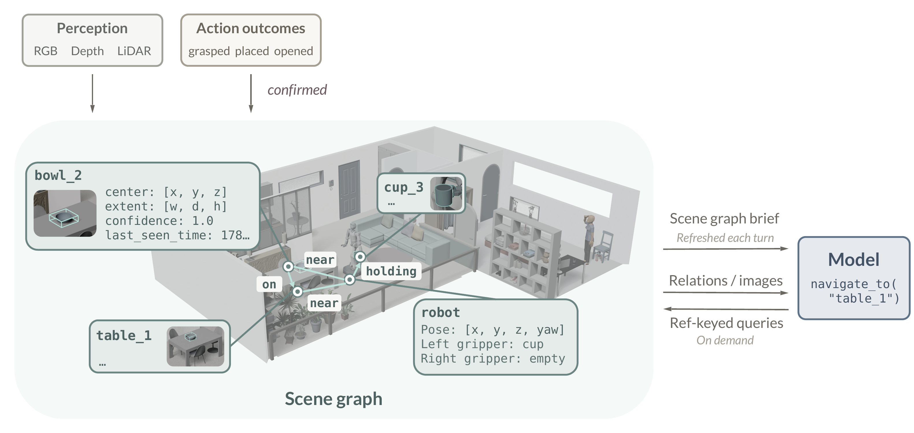
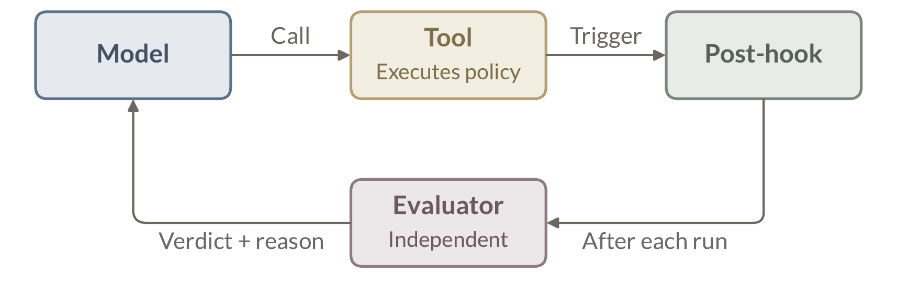

# 4 弥合鸿沟（Bridging the Gaps）

> 原文：<https://eit-hai.github.io/thea/gaps.html> ｜ 中文编译导读，精确表述以原文为准
> 上一章：[3 系统架构](03-system.md) ｜ 下一章：[5 实验](05-experiments.md)

---

上一章逐层迁移了 harness，每一层都有数字世界的对应物可作起点，工作主要是适配。本章要构建的，是**没有对应物**的部分。

第 1 章提出的鸿沟 1 和鸿沟 2 指出了两个会让回路本身断裂的缺失：物理世界天生既不可读、也不可验证，编程智能体免费继承的基础设施在这里必须自己建。

- **场景图**恢复可读性，给循环一个可引用的世界（§4.1）；
- **评估器**恢复可验证性，近似出世界不会给出的“退出码”（§4.2）；
- 还有第三个缺失，由于编程智能体从未遇到过而没有被列为鸿沟——**它们没有身体**。具身智能体有身体，它能感知什么、够到什么、做什么，取决于运行在哪个身体上。**本体档案（Embodiment Profile）**描述身体及其能力边界（§4.3）。

---

## 4.1 场景图即上下文（Scene Graph as Context）

作者通过两个相互关联的层恢复世界的可读性（图 6）：

- 一个**以物体为中心的场景图**，跨轮次维护持久的、符号化的世界状态；
- 一个**面向决策的接口**，把该状态带进模型上下文：默认是精简的场景图简报，需要更多细节时按物体 ref 查询。

§4.1.1 定义世界状态的表示及其更新过程；§4.1.2 说明模型如何读取状态、确认物体 ref，并把 ref 带入工具调用。

### 4.1.1 持久的世界状态

编程智能体继承的是一个有名字、可搜索的环境：搜一个符号，读返回的路径，再把同一路径交给下一个工具调用。物理智能体一无所有：视觉和深度观测只描述某一时刻的一个视角，机器人状态和工具反馈走不同通道，而且这些信号都不会把世界组织成循环可以反复引用的实体。

然而要继续一个任务，循环必须知道：它在追踪哪个实体、该实体上次在哪里被观测到、这份证据有多可信。因此作者**把转瞬即逝的信号变成持久的符号**：以物体为中心的场景图，为每个物体绑定一个稳定的 ref，并逐轮记录其粗略位置与新鲜度[22,23,24]。

```json
{
  "id": 2,
  "label": "cup",
  "center": [3.91, -0.18, 1.08],
  "extent": [0.099, 0.133, 0.096],
  "confidence": 1.0,
  "last_seen_time": 1778162862.957,
  "image_path": ".../2.jpg"
}
// 派生的 ref: cup_2
```

**Listing 8.** 一个已记录的物体节点（节选）。

**图结构。** 场景图把世界状态组织为节点、边和图元数据，沿用了把语义实体绑定到空间结构上的 3D 场景图表示[25]。

- **物体节点**带一个 ref（如 `cup_2`，由 label 和 id 派生）；ref 背后存有粗略 3D 包围盒、置信度、新鲜度，以及指向视觉证据的链接。
- **容器**（如柜子、抽屉）在同一节点上保存其状态和所跟踪的内容物。
- **机器人节点**跟踪位姿和持物状态。
- **边**编码物体、容器、机器人节点之间的 `on`、`inside`、`holding`、`near` 关系；例如 `near` 边携带两端之间的实测距离。
- **图元数据**记录来源、坐标系和更新时间。

**图的维护。** 持久的画面必须保持真实，而有两类变化会影响它：**机器人看到的**和**机器人做的**。

- **观测驱动的更新**：感知后端基于视觉和深度证据，刷新物体节点、粗略位置、置信度、新鲜度和空间关系，与动态场景图构建及真实世界 ObjectNav 系统中的结构化表示一脉相承[26,27,28]。
- **执行驱动的更新**：记录物理动作造成的变化，比如抓起物体、打开容器；动作条件化的场景图同样利用交互揭示原本隐藏的结构[29]。

在 Thea 中，执行驱动的输入是**有门控的**：工具结束后，评估器检查其后置条件（§4.2），**只有被确认的结果才能修改场景图**。例如，确认抓起后，标记机器人持有该物体并把它从原位置移除；确认打开柜子后，记录该容器为打开状态。harness 按物体 ref 解析两类输入并合并进同一张图，使场景图始终是世界的最新画面。



**图 6.** 维护与读取世界状态。观测驱动的更新和经评估器确认的动作结果按物体 ref 解析、合并进一张图，并带入下一轮。场景图简报每轮被推入刷新上下文；简报省略的证据可按 ref 查询按需获取。（场景布局使用 Sweet Home 3D 设计，含自由许可的 3D 模型与贴图。）

### 4.1.2 访问世界状态

```text
Scene graph brief:
 objects=10;
 stamp=1778162862.957
Robot: pose=[0,0,0,0],
 gripper empty
Observed objects:
 - cup_2 at (3.91,-0.18,1.08);
   conf=1
 - laptop_5 at (5.21,1.18,1.29);
   conf=1
 ...
```

**Listing 9.** 决策前渲染的场景图简报。

**场景图简报。** 每轮把整张图交给模型太多了：上下文窗口有限且受注意力约束（§3.2），而图中大多数细节与下一步决策无关。所以 harness 在刷新上下文中渲染一份**简报**：常用信息默认给出，其余按需获取。

- 几乎每个决策都要知道世界里有哪些物体、各在哪里、证据多可信——所以简报列出每个物体 ref 及其粗略位置、置信度和新鲜度。
- 机器人自身位姿和持物状态影响每一次动作选择；被跟踪的容器内容物让“已知但看不见”的物体仍可寻址——二者也进入简报。
- 只有特定决策才用得到的细节，如物体尺寸、关系边、存储图像，留在图中，可按 ref 检索。

简报之所以精简，是因为它**选择字段而不是裁剪节点**；边界不必精确，因为漏掉的东西只多花一次查询，不会导致失败。harness 每次调用前重新生成简报，同时跨调用保留图本身，让模型读到当前全局画面，而不必从累积消息里重建世界状态[13]。

**按 ref 查询。** 简报省略的内容，由模型自己去取。一小组查询工具按 ref 读取完整图，因此每个答案都挂靠在图已命名的实体上，而不会引入新实体：`get_object_relations` 返回某个 ref 的类型化关系，`get_image` 返回其节点上存储的视觉证据。

举例来说，场景图以类别层面命名物体。当用户要“那个红杯子”而简报里有三个杯子时，没有哪个 ref 能靠名字直接对上；模型就对候选调用 `get_image`，从存储的视图中读出颜色——这是本次决策需要的证据，而不是常驻上下文。“书桌旁边的杯子”这类空间线索则通过 `get_object_relations` 类似地解决。

**设计止步于工具，之后是模型自身的行为**：它决定发起哪个查询、何时发起；当收集到的证据都无法确定用户意图时，通过 `query_user` 询问；它把一次空查询视为“没有证据”而非“没有这个物体”，在断定物体不存在之前，会先获取新观测或检查可能的容器。把这些动作组合起来，模型就把一个模糊的说法解析为一个符号化实例，并把它的 ref 交给下一个动作工具，比如 `navigate_to(target="cup_2")`；这个绑定会在评估和重试过程中一直指向同一实体，直到新证据推翻它。

一个确认的 ref 决定了机器人追踪**哪个**实体、从**哪里**接近；它并不保证在当前位姿下已经可以操作。这一判断交给后续证据：靠近物体后由新观测确认可见性和对位，每个动作后由评估器裁定结果（§4.2）。**场景图只提供身份和粗略位置，仅此而已**——它让世界可读、可寻址，但不充当“是否就绪”或“是否成功”的神谕。

---

## 4.2 评估即退出码（Evaluation as Exit Codes）

在编程智能体范式中，环境本身会告诉智能体上一个动作结果如何：命令返回退出码，测试失败给出栈回溯，智能体据此调试[30]。物理世界不提供这种基础设施。刚尝试完抓取的机器人收不到任何信号来告诉它：任务仍在进行、已经成功、还是已经失败——更不用说为什么；抓滑了、撞上了，都不会有人报告。

补上这个缺失的判定**既不可或缺，也不容易**。第 2 章的可靠性分析表明，评估器准确率 α 直接限制了端到端任务成功率：**harness 的可靠性取决于它的裁判**。而且难度在两个世界里是倒过来的：编程智能体中单步可以自我评判，难题在整条轨迹层面才出现；物理世界里，**连评判单个动作都还是开放问题**。

因此 Thea 把评估做成 harness 的显式模块。评估器评判每个动作的结果，返回判定和结构化的失败原因——也就是世界从不提供的退出码和栈回溯。设计归结为三个问题（图 7）：

- **何时评判**——连动作何时结束都不会自己宣布；
- **谁来评判**——自报成功不能当作判定；
- **判定携带什么**——光秃秃的布尔值无法为重规划提供任何依据。



**图 7.** 每次操作后，harness 从结构上触发评估器。评估器只读取当前观测和该工具的后置条件，然后向模型返回带原因的三态判定。

**时机。** 何时评判取决于工具背后的策略类型。

- **端到端模型**[10,31]：没有信号标志完成，因此评估器在每个动作片段边界**在线**评判：`process` 表示应继续运行，`success` 表示后置条件已满足，`failure` 表示应停止执行；步数预算作为兜底。
- **Coding-as-Policy 方法**[32]：生成的程序会自行终止，并通过控制流报告进度，所以同一契约退化为两个终态。

**独立性。** 谁来评判由结构决定。harness 把评估器作为工具执行之后的**独立组件**，由后置钩子触发，而非由模型显式调用。其输入仅限两样：**当前观测**和**该工具的后置条件**（调用成功后世界应呈现的样子）[33]。它既不读模型的推理，也不读模型的自我汇报——这与 Anthropic 为其动作分类器采用的“对推理不可见”原则相同[34]。让模型给自己的工作打分，既不可靠[35]，还有偏[36]。

```json
{
  "status": "failure",
  "evidence": [
    "the bottle remains on the table",
    "the gripper closed without lifting it"
  ],
  "failure_reason":
    "the robot stopped too far from the bottle to grasp it"
}
```

**Listing 10.** 一次抓取失败时的评估器契约。

**判定内容。** 判定携带什么，决定了能进行怎样的恢复。仅有状态已经能闭合回路，但只是“盲目地”闭合：智能体可以重试，却无法调整。比如抓取失败，智能体需要知道原因是没够到目标、没抓准物体、物体被遮挡、还是抓起后掉落——不同原因需要不同的恢复方式。因此评估器除状态外还返回**证据**和**失败原因**（Listing 10）。

这种分工是刻意的[37,38]：评估器只负责评判结果、解释失败；下一步做什么交给智能体，因为只有智能体拥有评估器看不到的完整上下文。在下游，`success` 会门控动作后的场景图更新（§4.1），失败原因则进入任务结束时整合的工具经验（§3.5）。

---

## 4.3 本体档案（Embodiment Profile）

编程智能体从不需要被告知“身体”是什么：它通过 shell 和文件系统工作，这个接口到处都一样，拿不准时还能直接去查。机器人的身体不接受提问，而且没有任何东西是标准的。形态、传感几何、移动能力、可达范围因平台而异，并共同决定：有哪些证据可用、空间测量应如何解读、哪些动作可行。

本体档案把这些**身体特有的事实**明确写成一份精简、可替换的文档。部署时，harness 加载当前本体对应的档案，并在整个会话中保留。**替换档案就整体替换了身体相关的上下文，而任务指令保持同样形式**——这正是一个 harness 能跨本体移植的原因。把本体知识集中在一份文档里，也让它在各次决策中保持一致，更易于检查、维护和验证。

本体档案把稳定的身体信息分为三个互补部分，见表 2。

**表 2.** 本体档案的三个部分、存储项及其对模型决策的作用。

| 部分 | 档案项 | 存储信息 | 决策支持 |
|---|---|---|---|
| **运行包络**<br>Operational Envelope | 底盘占地 | 身体地面投影的半径或尺寸 | 把可用空间与身体占用面积关联起来 |
| | 底盘移动能力 | 支持的平移与旋转 | 排除底盘无法执行的运动命令 |
| | 可达工作空间 | 末端执行器的可达范围和作业高度 | 判断物体或位置是否在物理上可达 |
| **感知配置**<br>Perception Configuration | 传感模态 | 模型可用的证据类型 | 判断决策能否使用图像或距离证据 |
| | 模型可见视图 | 暴露给模型的已命名安装相机视图 | 确定模型可以请求哪些视图 |
| **相对底盘位置**<br>Base-Relative Positions | 相机位置 | 相对底盘中心的固定相机位置 | 把视觉证据定位到当前身体上 |
| | 初始夹爪位置 | 初始姿态下相对底盘中心的夹爪位置 | 把操作接口定位到当前身体上 |

- **运行包络**记录身体在运动和操作上的稳定极限。“底盘”指承载身体的部分——轮式底盘或人形机器人的双腿均可——条目记录的是它**能做什么**，而非**怎么做**。
- **感知配置**描述提供给模型的证据，如彩色图像和净空测量。
- **相对底盘位置**记录感知与操作接口相对于底盘中心的位置。

合起来看：运行包络约束可行动作，感知配置确定决策可用的证据，相对底盘位置则把证据和操作接口定位到当前身体上。

---

## 参考文献

10. Black et al. (2025), *π0.5: A Vision-Language-Action Model with Open-World Generalization*.
13. Anthropic (2025), *Effective Context Engineering for AI Agents*.
22. Gu et al. (2024), *ConceptGraphs: Open-vocabulary 3D scene graphs for perception and planning*.
23. Rana et al. (2023), *SayPlan: Grounding large language models using 3D scene graphs for scalable robot task planning*.
24. Yoneda et al. (2024), *Statler: State-maintaining language models for embodied reasoning*.
25. Armeni et al. (2019), *3D Scene Graph: A structure for unified semantics, 3D space, and camera*.
26. Rosinol et al. (2020), *3D dynamic scene graphs: Actionable spatial perception with places, objects, and humans*.
27. Takmaz et al. (2023), *OpenMask3D: Open-Vocabulary 3D Instance Segmentation*.
28. Zhu et al. (2026), *SysNav: Multi-Level Systematic Cooperation Enables Real-World, Cross-Embodiment Object Navigation*.
29. Jiang et al. (2024), *RoboEXP: Action-Conditioned Scene Graph via Interactive Exploration for Robotic Manipulation*.
30. Anthropic (2026), *Demystifying evals for AI agents*.
31. Black et al. (2024), *π0: A Vision-Language-Action Flow Model for General Robot Control*.
32. Fu et al. (2026), *CaP-X: A framework for benchmarking and improving coding agents for robot manipulation*.
33. Meyer (2002), *Applying 'design by contract'*.
34. Anthropic (2026), *How We Built Claude Code Auto Mode: A Safer Way to Skip Permissions*.
35. Huang et al. (2024), *Large Language Models Cannot Self-Correct Reasoning Yet*.
36. Panickssery et al. (2024), *LLM Evaluators Recognize and Favor Their Own Generations*.
37. Liu et al. (2023), *REFLECT: Summarizing Robot Experiences for Failure Explanation and Correction*.
38. Guo et al. (2024), *DoReMi: Grounding language model by detecting and recovering from plan-execution misalignment*.
