# 5 实验（Experiments）

> 原文：<https://eit-hai.github.io/thea/experiments.html> ｜ 中文编译导读，精确表述以原文为准
> 上一章：[4 弥合鸿沟](04-gaps.md) ｜ 下一章：[6 相关工作](06-related.md)

---

作者在真实环境中的真实机器人上评估 Thea，围绕三个问题：

1. 随着任务复杂度增加，完整 harness 与其他执行架构相比表现如何？
2. 闭环执行所依赖的评估器，对进行中任务状态的判断有多可靠？
3. 在不同本体上的完整部署中，工具组合会涌现出哪些能力？

---

## 5.1 任务设置

实验涉及三种本体各异的机器人：

- **Astribot S1**（主要定量实验平台）：轮式双臂人形机器人，具有可驱动的头部和躯干、全向移动底盘和两个夹爪末端执行器，共 25 个自由度。
- **AgileX Cobot Magic**：双臂 + 移动底盘。
- **Unitree G1**：搭载 BrainCo Revo 2 灵巧手，每只手 6 个自由度。

这些部署用来检验：同一个 harness 能否组合由不同物理接口暴露的能力。

**表 3.** 难度递增的真实世界任务。

| 级别 | 任务 | 描述 |
|---|---|---|
| L1 | 短时程操作 | 从桌上拿起一个物体放进篮子 |
| L2 | 长时程操作 | 把桌上所有物体都放进篮子 |
| L3 | 导航 + 操作 | 导航到一张桌子，取回指定物体，送到目标桌子 |

- **L1** 是简单的抓放，在固定桌面上隔离出单个操作周期。
- **L2** 保持固定桌面，但拉长了时程：智能体必须反复定位、抓取、放置桌上每个物体，并在多个操作周期间跟踪进度。
- **L3** 最难，把导航和操作耦合在两个工作区之间：前往源位置、识别并取回指定物体、导航到目的地、完成交付。

各任务中物体类别和摆放位置都有变化。每种方法在 L1、L2 上各做 20 次独立试验，L3 上做 15 次。

**对比系统：**

- **端到端策略**：ACT[39]、LingBot-VLA-V2[40]、π0.5[10]；
- **Coding-as-Policy 基线**：CaP-X[32]，按 CaP-Bench M3 设置，利用执行轨迹以及描述初始场景、后续视觉变化和任务完成情况的结构化文本，多轮修改机器人控制程序；
- **分层规划方法**：基于 SayCan[41]。

Thea、CaP-X 和 SayCan 的决策模型均使用 **GPT-5.5**（reasoning effort 设为 high）。感知方面，Thea 基于 Astribot S1 SDK 和 SysNav[28]。每个端到端策略在每个任务上用 200 条采集的示范进行训练或微调。

Coding-as-Policy 和分层规划方法使用**与 Thea 相同的工具及底层实现**（附录 A 表 4）。对这两个编排类基线而言，这控制住了底层机器人能力，只比较各架构如何选择、组合工具以及失败时如何恢复。端到端基线中的 ACT 和 π0.5，正是 Thea 操作工具背后所用的同一批策略。因此下文报告的差异反映的是**各架构编排的完整程度**，而非底层策略的能力。

---

## 5.2 随任务复杂度的扩展

图 8 报告了 ACT、LingBot-VLA-V2、π0.5、CaP-X、SayCan 和 Thea 在 L1–L3 上的任务成功率。除绝对性能外，这一比较还展示了各架构在任务时程和组合复杂度增长时的扩展情况。

只有当指令中指定的每个物体都到达目标位置、且机器人完成了所有必需的导航和操作阶段时，一次试验才算成功；结果由人工标注员根据录制的轨迹判定，与在线评估器相互独立。

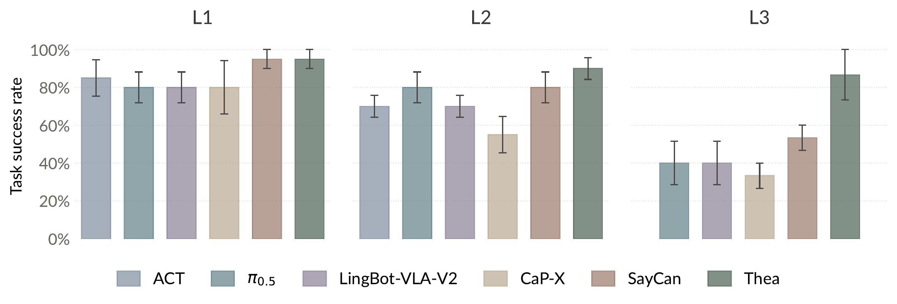

**图 8.** 基线与 Thea 在难度递增任务上的成功率。误差棒为各次运行的一个标准误。ACT 不支持语言条件输入，因此未参加 L3。

**Thea 在三个级别上都取得了最高成功率。**

- **L1**：各方法差距很小。
- **L2**：Thea 评估每次抓取并重试失败的抓取，而不是带着无效序列继续往下执行。
- **L3**：智能体先调用 `navigate_to`，再用 `move_base` 把机器人调整到更适合下一次操作的位姿；操作失败时还会再次调整位姿。

对比之下：端到端策略（ACT、LingBot-VLA-V2、π0.5）在任务中途失败时无法察觉，运行无法恢复；CaP-X 在多轮中生成并修改程序；SayCan 选择下一个技能时，对上一个技能没有任何判定。

从 L1 到 L3 不断拉大的差距，符合第 2 章的可靠性计算——单步失败随任务长度累积。它同时体现了 harness 的关键特性：模型按任务需要选择和组合工具，评估器闭合回路，让结果可观测、失败可恢复。

---

## 5.3 评估器准确率

如第 2 章分析所示，上述恢复能力建立在评估器之上。因此作者测量了评估器对进行中物理任务状态判断的可靠性。

- **测试集**：从 Astribot S1、AgileX Cobot Magic 和 Unitree G1 收集的 90 个轨迹检查点，在“成功完成后”“执行中”“未恢复的失败后”三种状态中等量采样。
- **标注**：两名标注员基于完整轨迹独立标注，分歧通过回放和讨论解决。
- **评估器模型**：整个实验中使用 Qwen3.7-Plus[42]。测试时评估器只看到其评估提示（含该工具的后置条件，即调用后预期的世界状态）和同步的相机观测。

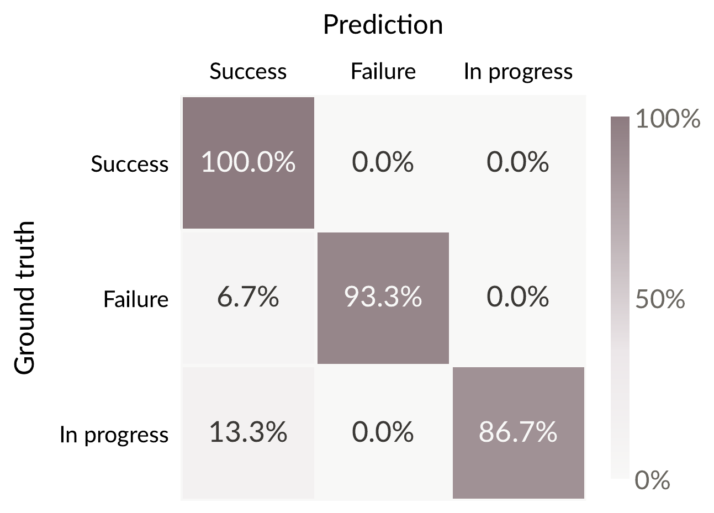

**图 9.** 三种机器人本体上，评估器预测与真实的成功、失败、进行中状态的对比。

图 9 分别报告了各状态的分类表现，**平均准确率 93.3%**。剩余错误全部朝同一个方向：6.7% 的失败检查点和 13.3% 的进行中检查点被判为成功，而没有任何成功检查点被误判。这些恰恰是**有害的错误**——误判成功要么放弃了必要的重试，要么过早截断了动作。降低这种错误是重要的下一步工作。

把实测准确率 α = 0.93（三态平均，作为第 2 章二元 α 的近似）、单步成功率 p = 0.8、最多 k = 5 次重试代入第 2 章公式，一个五步任务的完成概率在开环下为 **0.33**，在 harness 下为 **0.91**，与图 8 的趋势大体一致。

---

## 5.4 涌现能力

本节从上述固定任务转向更复杂、更真实场景中更长的开放式任务。Thea 以完整 harness 运行，所有工具和组件都可用，作者观察智能体整体能从中组合出什么。以下演示是涌现能力的抽样，附录 C 给出了演示的执行日志。

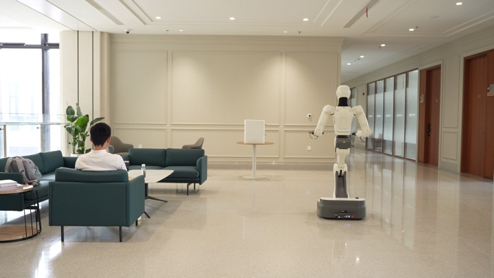 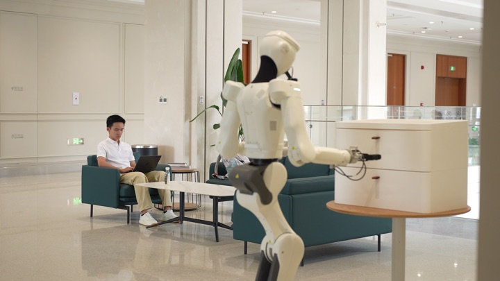 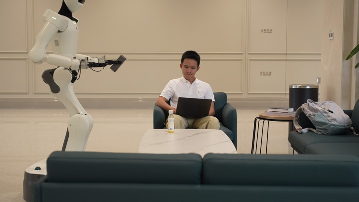

**(a)** 机器人在运行时组合出一段长时程的导航与操作序列，取回并递送一个充电宝。

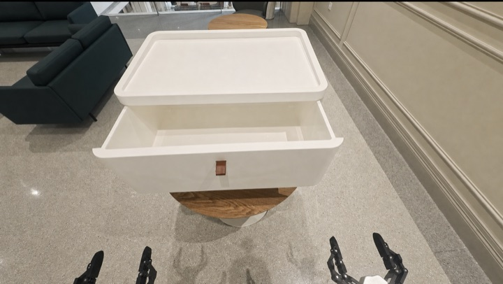 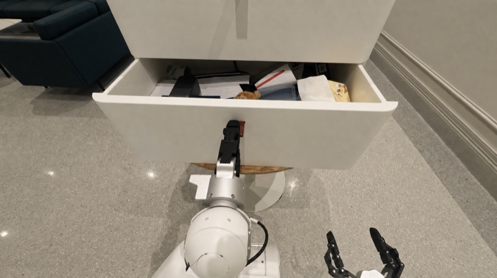 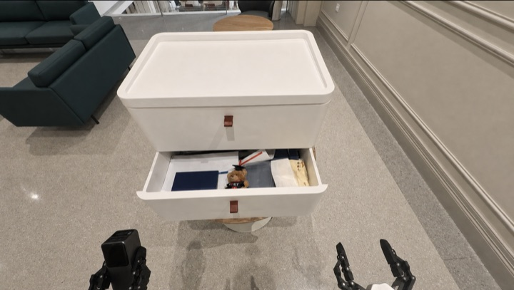

**(b)** 目标不在场景图中时，机器人主动搜索柜子抽屉以找到充电宝。

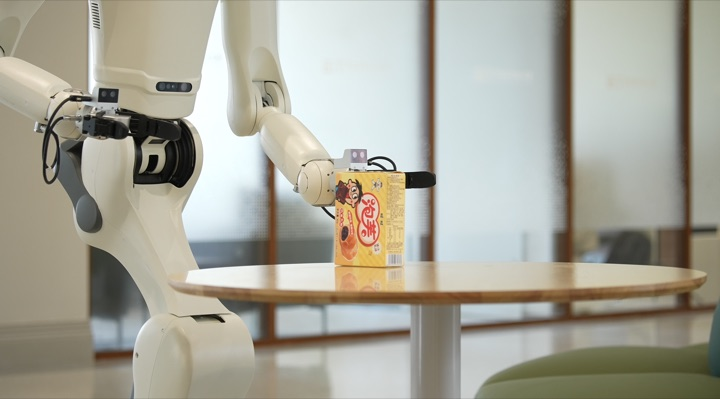 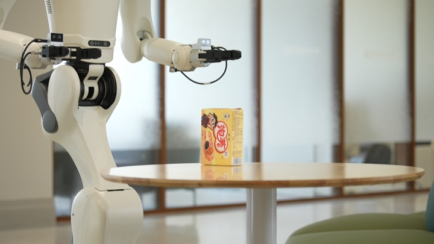 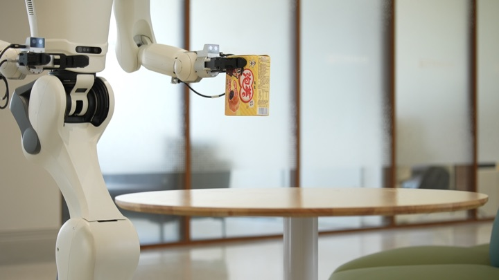

**(c)** 首次抓取失败后，机器人根据评估器给出的失败原因调整相对物体的位置，完成抓取。

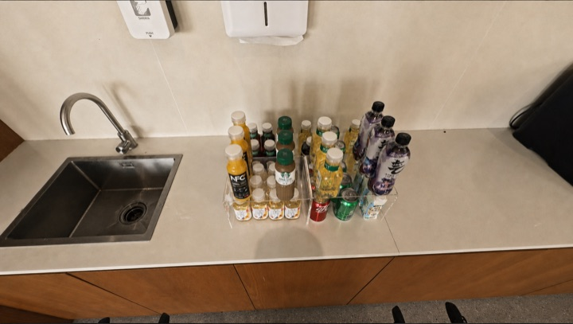  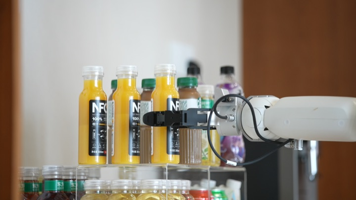

**(d)** 所要的水没有时，机器人询问用户换成什么，然后取回用户选择的饮料。

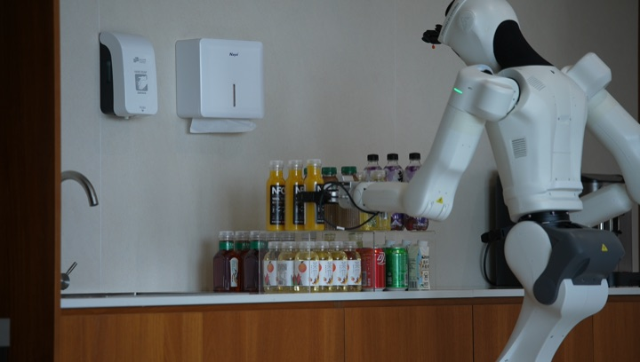 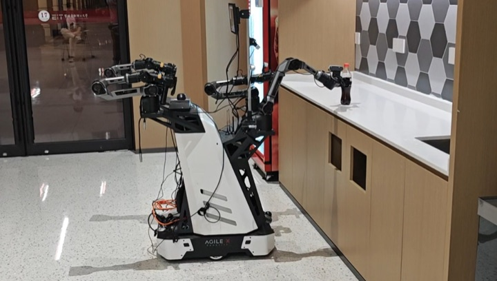 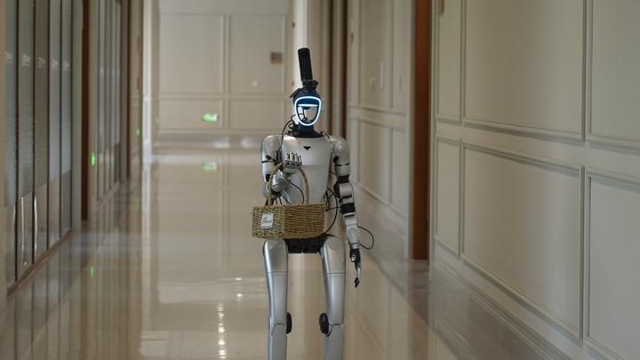

**(e)** 三台机器人共享同一个 harness，各自使用本体特定的档案和工具实现。

**图 10.** 共享 harness 带来的涌现能力演示：长时程任务组合、主动感知、失败恢复、用户交互、跨本体可移植性。

**长时程任务组合。** 在这些部署中，Thea 能把用户请求贯彻到底，完成很长的物理交互序列。难点集中在导航与操作交替进行的地方，因为每次操作都取决于上一次移动把机器人留在了哪里。Thea 用工具组合出这种交替（图 10a）：从场景图读取目标位置，用 `navigate_to` 接近，在实测净空范围内用 `move_base` 微调底盘位姿，把每次操作的结果交给评估器，由其判定决定是调整重试还是继续。图 10 中每条代表性轨迹都是运行时用同一套通用工具组合出来的，**没有一条遵循为该任务预先准备的脚本**。

**主动感知。** 主动感知有两种形式：

- 当请求的物体在场景图中完全找不到时，Thea **探索环境**：导航到柜子，依次打开并检查抽屉（图 10b），把原本被遮挡的内容物写进场景图。
- 当证据在当前视野之外时，Thea **调整视角**：调用 `tilt_head` 把相关区域纳入相机视野。

二者尺度不同——一个移动身体、一个移动相机——但逻辑相同：**感知本身是模型选择的一种动作**，新的感知为下一步决策提供信息。

**失败恢复。** 物理执行并不总能第一次就满足预期的后置条件。不满足时，评估器返回失败及原因，Thea 根据该原因和周边证据决定下一个调用（图 10c）——可能先调整底盘位姿再重试，或换一个由不同策略支撑的工具。重试成功后，任务结束时的整合过程会把这次恢复写进该工具的经验。

**用户交互。** Thea 在整个任务中都保持用户可达。请求可能含糊，选择可能取决于用户偏好，进展可能值得告知；`query_user` 和 `notify_user` 正是为这些时刻准备的，模型在需要时调用。在饮料场景（图 10d）中，用户要一瓶水而场景图里没有水；Thea 没有自作主张拿个替代品，而是询问用户要它看到的哪一种饮料，并取回用户选的那一瓶。

**跨本体可移植性。** 同一个 harness 在 Astribot S1、AgileX Cobot Magic 和 Unitree G1 三种本体上运行（图 10e）。循环中没有任何内容指向特定身体；身体相关的内容通过本体档案和注册表背后的工具实现进入。因此迁移到新机器人只需编写它的档案和工具，而其上的循环——理解请求、选择工具、权衡评估器判定——原封不动地沿用。

---

## 参考文献

10. Black et al. (2025), *π0.5: A Vision-Language-Action Model with Open-World Generalization*.
28. Zhu et al. (2026), *SysNav: Multi-Level Systematic Cooperation Enables Real-World, Cross-Embodiment Object Navigation*.
32. Fu et al. (2026), *CaP-X: A framework for benchmarking and improving coding agents for robot manipulation*.
39. Zhao et al. (2023), *Learning Fine-Grained Bimanual Manipulation with Low-Cost Hardware*.
40. Wu et al. (2026), *From Foundation to Application: Improving VLA Models in Practice*.
41. Ahn et al. (2022), *Do As I Can, Not As I Say: Grounding Language in Robotic Affordances*.
42. Qwen Team (2026), *Qwen3.7-Plus: Multimodal Agent Intelligence*.
